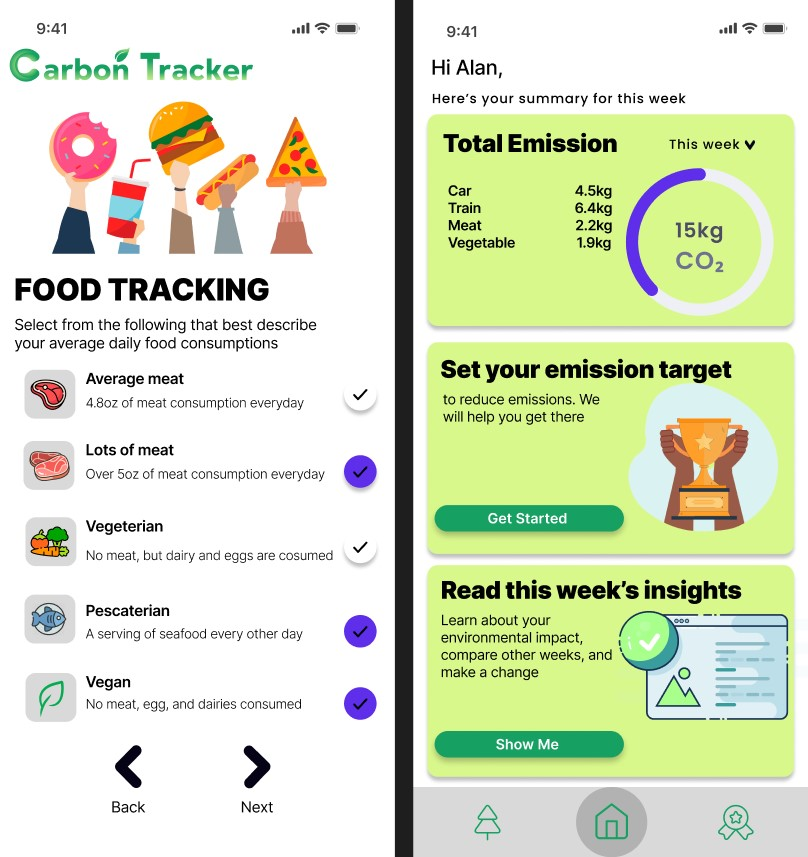

# Carbon Footprint Analyzer

## What does our app do?
- Tracks carbon footprint in daily life 
- Miles driven
- Transportation
- Food 
- Shower and how long it took
- Waste (Compost, landfill, recycling)

## Back-end
- Created two classes for weekly and daily logs 
- Daily logs will store specific statisics of carbon emission 

## UI
- Slider for users to choose hours/ time spent on each activity that causes carbon footprint
- Calculate your carbon footprint
- Personal advice, tips, and actions 
- Sharing function and allow others to motivate each other 
- Setting goal function 
- Logo creation

